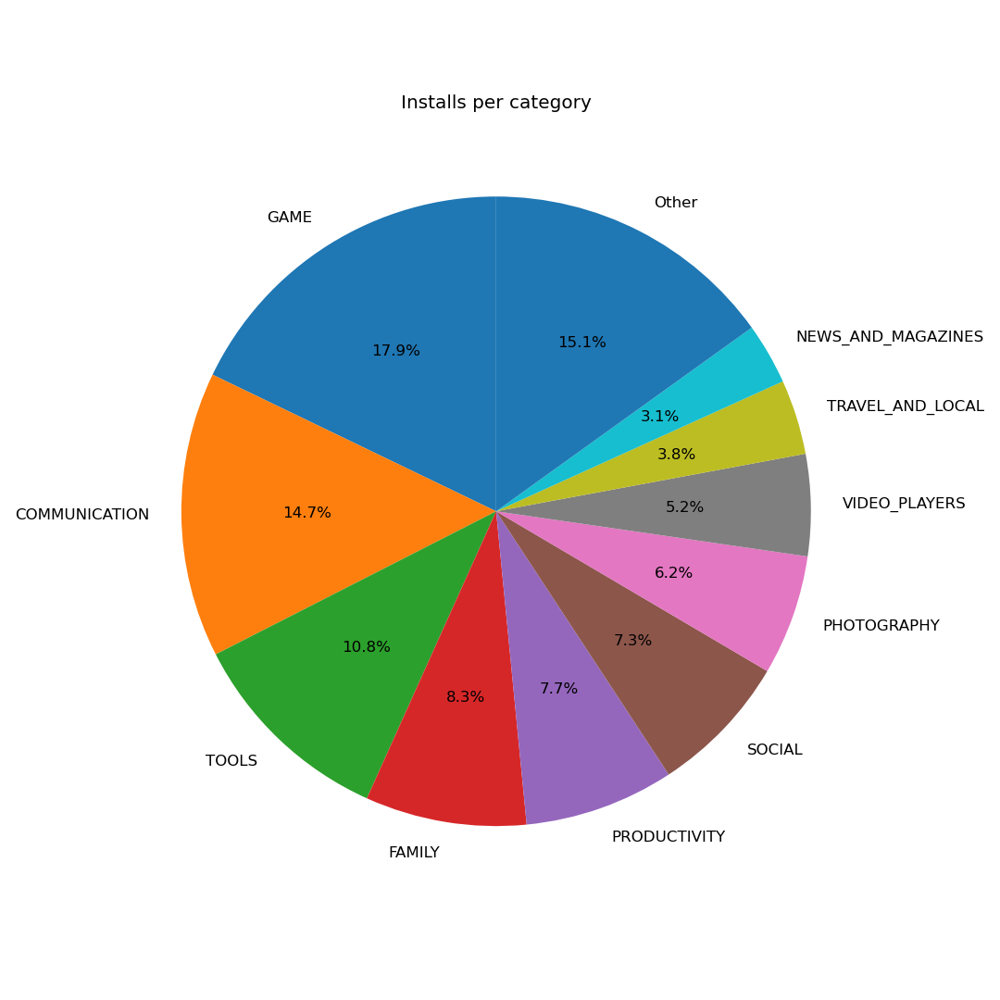
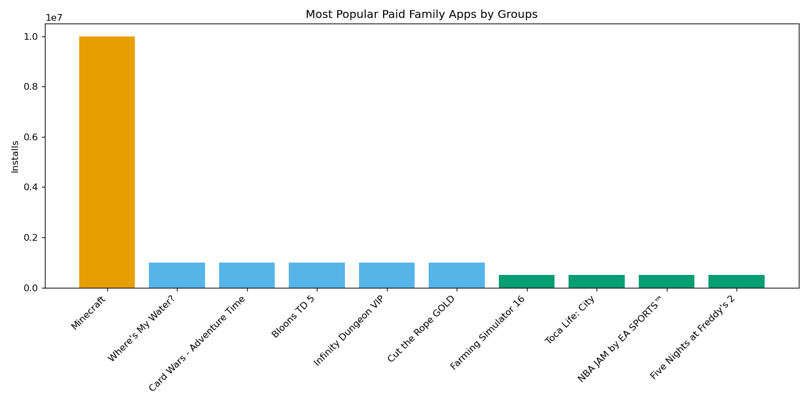
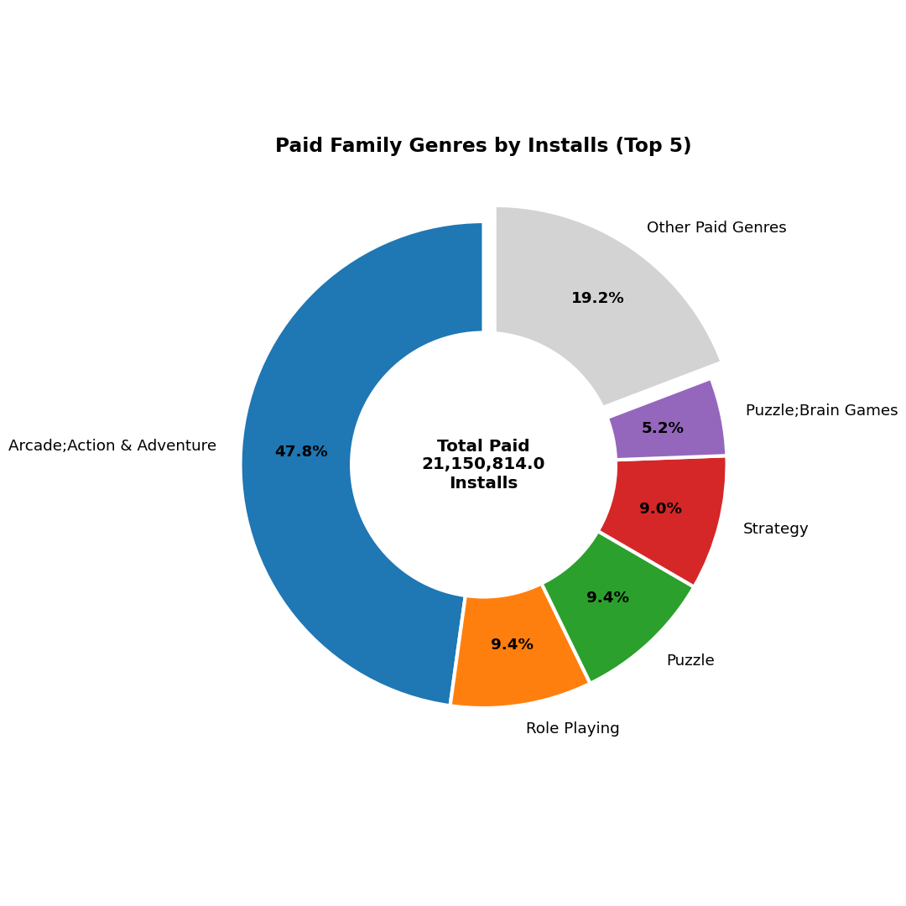
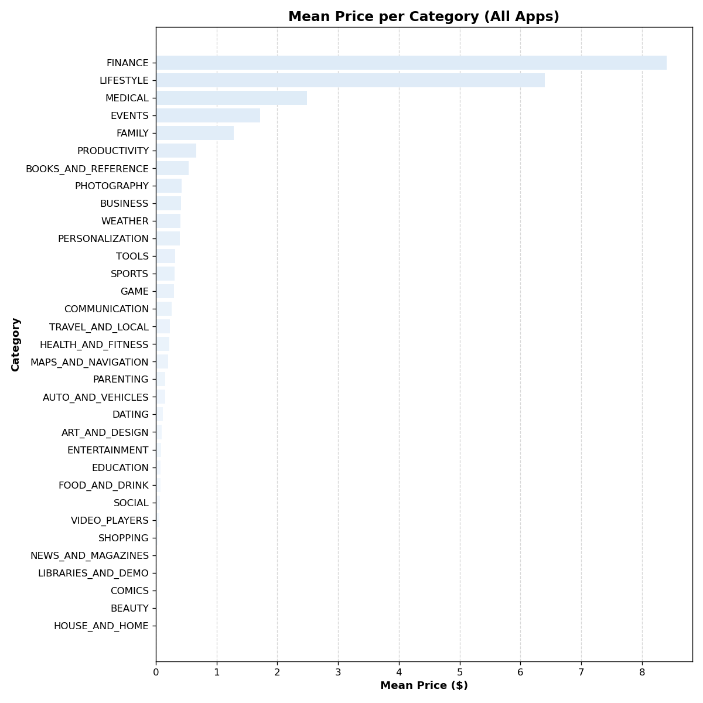

# Google Play Store: A Market Analysis for My MobApp Studio

*An exploratory data science experiment to size the mobile app market and guide our next app decision.*

---

## 1. Context & Business Question

My MobApp Studio is allocating resources to build a new mobile app, launching first on the **Google Play Store**. Before committing, management asked for a market report answering:

- How big is the market - in number of downloads and in dollars?
- The same, broken down per category (in percentages)?
- For each category, the ratio of downloads per app?
- Any additional insight useful for the decision.

This post treats those questions as a **scientific experiment**: we state assumptions, run each analysis step explicitly, report the results, and conclude with next steps.

---

## 2. Hypothesis & Assumptions

**Main hypothesis:**
> Play Store downloads concentrate in a few free-dominated categories, so the biggest categories are the cheapest — meaning the best opening for a paid app is a mid-sized, paid-friendly category rather than the largest one.

**Sub-predictions we will test**:
- A few categories will account for the majority of all installs (concentration, not uniformity).
- The top-download categories will have low mean prices (free-dominated business models).
- High mean prices will appear in utility/professional categories, not in the mass-market high-volume ones.
- The FAMILY category specifically will be large enough to matter, will tolerate a paid model, but will be fragmented and game-driven rather than education-driven.

**Assumptions we make about the data:**
- The dataset is a representative snapshot of the Google Play Store at the time of collection (2026-06-06).
- `Installs` is reported in bucketed thresholds (e.g. "1,000+"), so totals are approximate lower bounds, not exact figures.
- Revenue is approximated as `Price × Installs` for paid apps; in-app purchases and ads are **not** captured, so dollar figures understate real revenue.
- Duplicate app rows are data-collection artefacts and should be removed before aggregating.

---

## 3. Data & Methodology

**Dataset:** Google Play Store apps dataset (`googleplaystore.csv`) - 10841 raw rows, 13 columns.

**Tools:** Python, pandas, matplotlib.

**Cleaning steps** (implemented in `clean_dataset()`):
- Removed duplicate rows and duplicate apps.
- Converted `Installs` ("10,000+") and `Price` ("$4.99") to numeric.
- Converted `Reviews` ("3.0M") and `Size` ("19M") to numeric; "Varies with device" → missing.
- Dropped the known corrupted row.
- Filled missing `Rating` with the median; left `Size` missing values as-is (see note).

> **Note on imputation:** filling `Rating` with the median keeps rows without inventing implausible data, but it creates an artificial spike at the median and slightly lowers variance — we keep this in mind when interpreting the rating distribution.

After cleaning: **9659 apps** across **5 categories**.

---

## 4. Experiment & Results

Each subsection states what we measured, presents the results, and interprets them.

### 4.1 Market size - total downloads and dollars

- **Total downloads:** 75,322,526,427
- **Estimated total dollar value (paid apps only):** $291,140,168.79


### 4.2 Downloads and value per category (percentages)

Downloads are heavily concentrated rather than evenly spread across the store. The single largest category, GAME, accounts for nearly one in five installs (17.85%), and together with COMMUNICATION (14.65%), the top two categories alone capture roughly a third of all downloads (32.5%). The eight categories shown here add up to about 78% of total installs

| Category | Installs | % of total |
|----------|---------:|-----------:|
|GAME | 1.344792e+10 | 17.85 |
|COMMUNICATION | 1.103828e+10 | 14.65 |
|TOOLS | 8.102772e+09 | 10.76 |
|FAMILY | 6.237543e+09 | 8.28 |
|PRODUCTIVITY | 5.793091e+09 | 7.69 |
|SOCIAL | 5.487868e+09 | 7.29 |
|PHOTOGRAPHY | 4.658148e+09 | 6.18 |
|VIDEO_PLAYERS | 3.931903e+09 | 5.22 |

Apart from GAME, the top of the list is dominated by everyday utility and communication apps: COMMUNICATION, TOOLS, PRODUCTIVITY, SOCIAL, PHOTOGRAPHY, and VIDEO_PLAYERS. These are high-frequency, broad-audience categories where a few dominant apps (messengers, browsers, players) absorb enormous install counts. That concentration is worth keeping in mind: a large share of a category's downloads often belongs to a small number of incumbents, so raw category size does not automatically translate into an easy opportunity.



 FAMILY sits in fourth place at 8.28% — a meaningful slice of the market and notably the category we are asked to examine most closely. It is large enough to be commercially interesting without being as saturated by a few global giants as GAME or COMMUNICATION. We will revisit this in section 4.3, where downloads per app tell us whether a category's volume is shared across many competitors or captured by a few.

### 4.3 Downloads per app, by category (concentration)

Total installs tell us how big a category is; installs per app tell us how that volume is shared among the apps competing inside it. The two tables tell very different stories.

The clearest example is GAME. It topped the download charts at 17.85% of all installs, yet here it sits near the bottom of the high-concentration group at ~14.2M installs per app — and the reason is visible in the "Apps" column: GAME has 945 apps, by far the most of any category. Its market leadership is built on sheer quantity of titles, not on each title performing exceptionally. In other words, GAME is large but crowded: the downloads are spread thin across a huge field of competitors.

COMMUNICATION is the mirror image. It ranks first on this measure at ~35M installs per app, almost 50% higher than the next category, despite having only 315 apps. A small number of dominant apps (messengers, browsers, dialers) absorb enormous install volumes. High per-app downloads here do not signal an easy opening; they signal entrenched incumbents. VIDEO_PLAYERS (~24M over 164 apps) and SOCIAL (~23M over 239 apps) show the same concentrated pattern.

FAMILY ranked fourth in total downloads (8.28%) yet does not appear in this list at all, meaning its installs-per-app falls below the 10M cutoff. Combined with the fact that FAMILY is a notoriously app-heavy category, this points to a fragmented market: large in aggregate, but with downloads divided across many titles, so the average app captures comparatively little. ENTERTAINMENT is the opposite shape worth noting - just 86 apps but ~11.4M installs each, the leanest competitive field in the group.

| Category | Apps | Installs/app* |
|----------|-----:|-------------:|
|COMMUNICATION | 315 | 35042147.0|
|VIDEO_PLAYERS | 164 | 23975017.0|
|SOCIAL | 239 | 22961790.0|
|PHOTOGRAPHY | 281 | 16577038.0|
|PRODUCTIVITY | 374 | 15489549.0|
|GAME | 945 | 14230608.0|
|TRAVEL_AND_LOCAL | 219 | 13218663.0|
|ENTERTAINMENT | 86 | 11449535.0|
*Ratio = total installs in category ÷ number of apps in category. Apps with > 10,000,000 

The takeaway is that category size and per-app yield must be read together. A high ratio can mean a few giants own everything (COMMUNICATION); a low ratio can mean the audience is real, but attention is fragmented (GAME, and likely FAMILY). Neither is automatically "good" - but they call for different strategies: differentiation and a niche in crowded categories, versus competing head-to-head with incumbents in concentrated ones.

### 4.4 Most popular paid apps in the Family category

The paid Family chart is dominated by a single app—Minecraft — with roughly 10,000,000 installs, which towers over every other paid app in the category; it has about 10 times the downloads of its nearest competitors. Everything else falls into two clear tiers below it: a middle band of around 1,000,000 installs (Where's My Water?, Card Wars – Adventure Time, Bloons TD 5, Infinity Dungeon VIP, Cut the Rope GOLD) and a lower band of around 500,000 (Farming Simulator 16, Toca Life: City, NBA JAM by EA SPORTS, Five Nights at Freddy's 2).



A pattern worth noticing is that almost every top paid Family app is effectively a game - Minecraft, the Cut the Rope and Bloons franchises, Five Nights at Freddy's, Farming Simulator. This echoes a point from the category analysis: the FAMILY label on Google Play is broad and heavily overlaps with games, so "Family" success here largely means kids'-/family-friendly game success. It also reinforces why FAMILY behaves like a fragmented, game-adjacent market rather than a distinct one.

Minecraft's dominance shows the ceiling a paid Family title can reach is high, but the steep fall-off shows that outcome is exceptional - most paid apps here cluster at one million downloads or, more commonly, half that. A realistic baseline expectation for a new paid entrant is the 500K-1M band, not the Minecraft tier. Several of the names in that band are established franchises with built-in audiences, which raises the bar for an unknown app competing on price.

### 4.5 Most popular genres among paid Family apps

Within paid Family apps, installs are dominated by a single genre: Arcade; Action & Adventure captures 47.8% of all downloads - nearly half the entire segment on its own, and more than five times the share of the next genre. This is an even steeper concentration than we saw at the app level in 4.4, and it largely reflects the same fact: Minecraft and the other top paid Family titles fall into this genre, so one breakout app pulls its whole genre to the top.

Below that dominant slice, a cluster of game genres splits the middle of the chart fairly evenly - Role Playing (9.4%), Puzzle (9.4%), Strategy (9.0%), and Puzzle; Brain Games (5.2%) — followed by a long tail of small slices each under 5% (Card; Action & Adventure, Sports; Action & Adventure, Education; Pretend Play, and others trailing below 3%). The shape is one big genre, a handful of moderate ones, and a scatter of niche genres.



Two things stand out for our decision. First, this confirms in detail what earlier sections hinted at: paid "Family" success is overwhelmingly game success. Every leading genre here is a game type; genuinely education- or play-oriented genres like Education; Pretend Play appear only as small slices in the tail. The Family category sells to families primarily through games, not through educational or productivity tools. Second, the dominance of Action & Adventure variants suggests that's where paid demand actually concentrates - but also where Minecraft already owns the space, so it's the most rewarding genre by volume and simultaneously the hardest to break into.

### 4.6 Mean price per category

Average prices are highly skewed across categories. FINANCE leads at roughly $8.40, followed by LIFESTYLE at about $6.40 - the two clear outliers. After a sharp drop, MEDICAL (~$2.50), EVENTS (~$1.75), and FAMILY (~$1.30) form a small middle tier, and from PRODUCTIVITY onward the bars collapse toward zero: the large majority of categories carry a mean price well under $1.00, with the long tail (SHOPPING, NEWS_AND_MAGAZINES, COMICS, BEAUTY, HOUSE_AND_HOME) effectively at zero. The overall shape says the Play Store is overwhelmingly a free/low-price marketplace, with only a few categories where paid apps command meaningful prices.



The categories that price high are revealing: FINANCE, LIFESTYLE, MEDICAL, and EVENTS are utility- and professional-leaning, where an app solves a concrete, often work- or money-related problem and users are willing to pay for it. The categories pinned near zero - SOCIAL, VIDEO_PLAYERS, SHOPPING, NEWS - are exactly the ones that monetize through ads, subscriptions, or commerce rather than an upfront price. In other words, mean price is less a measure of "value" than a signal of which business model dominates a category.

It's also worth connecting this to the earlier sections. The highest-download categories from 4.2 - GAME, COMMUNICATION, TOOLS, SOCIAL - all sit in the low-price zone here, which underlines that volume and price pull in opposite directions: the biggest markets are big precisely because they're free. FAMILY is an interesting middle case: it carries one of the higher mean prices (~$1.30), meaning paid Family apps are a real and accepted model, even if, as 4.4 showed, the download ceiling for any single paid title is modest.

### 4.7 Most expensive app per category

The top of the price range is dominated by novelty "rich" apps rather than genuine premium software. The three highest entries: I'm Rich - Trump Edition (LIFESTYLE, $400.00), I Am Rich Premium (FINANCE, $399.99), and I am Rich Plus (FAMILY, $399.99) - are all variations of the same joke product: apps whose only real function is to signal that the owner spent ~$400 on them. They cluster right at the $400 ceiling, which appears to be a practical maximum price for the store at the time.

| Category | App | Price* |
|----------|-----|------:|
|LIFESTYLE | I'm Rich - Trump Edition | 400.00|
|FINANCE | I Am Rich Premium | 399.99|
|FAMILY | I am Rich Plus | 399.99|
|MEDICAL | EP Cook Book | 200.00|
|PRODUCTIVITY | cronometra-br | 154.99|
|EVENTS | BP Fitness Lead Scanner | 109.99|
* > $100.00

FINANCE and LIFESTYLE topped the mean-price chart not because finance and lifestyle apps are systematically expensive, but because a handful of $400 novelty apps dragged those category averages upward. Category averages should be read with the outliers in mind, and ideally reported as medians.

Below the novelty tier sit apps that look like real, if niche, premium products: EP Cook Book (MEDICAL, $200.00), cronometra-br (PRODUCTIVITY, $154.99), and BP Fitness Lead Scanner (EVENTS, $109.99). These are plausibly professional or specialist tools - medical reference, time-tracking, event lead scanning - where a high price targets businesses or professionals rather than ordinary consumers. That distinction matters: it shows the store does support genuinely high-priced apps, but only in narrow B2B-style niches, not in the mass-market categories that drive download volume.

---

## 5. Conclusion

The experiment **confirmed the main hypothesis**, and each sub-prediction held.

The top eight categories captured roughly 78% of all installs, led by GAME (17.85%) and COMMUNICATION (14.65%). The store follows a clear head-and-long-tail distribution: a handful of categories dominate, and dozens of others share what remains.

The highest-download categories - GAME, COMMUNICATION, TOOLS, SOCIAL - all sit near the bottom of the mean-price chart, confirming they are large precisely because they are free and monetize through ads or subscriptions. The categories with the highest mean prices (FINANCE ~$8.40, LIFESTYLE ~$6.40) turned out to be inflated by novelty "I am Rich" apps priced at ~$400, not by genuine premium demand. Once those outliers are recognized, the store reveals itself as overwhelmingly a free / low-price marketplace where only narrow professional niches sustain high prices.

The per-app view separates real opportunity from crowding. COMMUNICATION led on installs-per-app (~35M) - a winner-take-most market owned by entrenched incumbents - while GAME, despite its size, was thin per app because its volume is spread across 945 titles. FAMILY did not even reach the high-concentration cutoff, marking it as a fragmented category: large in aggregate, but with attention divided across many apps.

On FAMILY specifically, the data was consistent throughout. It ranks fourth in total downloads (8.28%) and carries one of the higher non-outlier mean prices (~$1.30), so a paid model is genuinely accepted there. But its paid market is overwhelmingly games - Arcade; Action & Adventure alone accounts for 47.8% of paid-Family installs, and the top paid titles (Minecraft, Cut the Rope, Bloons) are all games. Educational genres appear only in the long tail.

**Recommendation**. Competing in the largest categories (GAME, COMMUNICATION) means fighting free incumbents head-on; chasing the high-price categories means either novelty gimmicks or narrow B2B tools - neither fits a consumer studio. The strongest fit is a paid Family game in a popular, paid-friendly genre (arcade / action-adventure or puzzle), priced realistically in the low single digits ($1–$3) rather than as a premium product. A realistic download expectation is the 500K–1M band, not the Minecraft tier, so the business case should be built on that baseline. If the studio prefers to chase higher volume, the alternative is a free Family game monetized through ads or in-app purchases - trading guaranteed per-unit revenue for a larger potential audience.

---

## 6. Limitations & Next Steps

**Limitations:**
The `Installs` field is reported in thresholds ("1,000,000+", "500,000+"), so every total, percentage, and per-app ratio in this report is an approximation - and specifically a lower bound. This is most visible in section 4.4, where the flat plateaus at exactly 1M and 500K are an artifact of the buckets, not true ties. All download figures should be read as relative magnitudes, not precise counts.

Dollar figures were approximated as `Price × Installs` for paid apps only. This ignores in-app purchases, subscriptions, and advertising - which are the primary revenue model for exactly the high-volume, free-dominated categories (GAME, SOCIAL, COMMUNICATION). The true economic size of the market is therefore far larger than our paid-only estimate, and the free categories are commercially much more valuable than their $0 price suggests.

Both the mean-price chart (4.6) and the installs-per-app ratio (4.3) are averages, and both were shown to be skewed - mean price by the ~$400 "I am Rich" novelty apps, and per-app installs by a small number of mega-apps. Medians were not computed, so the "typical" app in each category remains partly hidden behind these averages.

`Genres` are stored as semicolon-joined strings (e.g. "Arcade;Action & Adventure"), so conceptually similar genres are counted separately. This likely understates the true dominance of action/adventure-style play in paid Family apps (section 4.5).

The dataset is one point-in-time scrape. It carries no information about growth, seasonality, or trend, so we can see what the market looks like but not where it is heading - and a market-entry decision ideally depends on direction, not just current size.

We removed duplicate apps, dropped rows with unparseable values (including the known corrupted row), filled missing ratings with the median, and left missing Size values as NaN. These are defensible choices, but they shape the dataset; a different cleaning strategy could shift the marginal figures.

**Next Steps**

The fastest, highest-value follow-up: report median installs-per-app and the mean/median price of paid apps only (excluding $0). This would directly correct the two biggest distortions in this report and give a much more honest read of what a typical app - and a typical paying user - actually represents.

With `Reviews`, `Rating`, and `Size` already cleaned to numeric, the natural next experiment is a correlation and regression analysis: do ratings or review counts predict installs, and how does that differ between free and paid apps? This moves us from describing the market to explaining it.

Layer in a model for ad/IAP monetization so the high-volume free categories can be valued properly. Even a rough industry-benchmark estimate (revenue per install by category) would reframe which categories are genuinely the most lucrative.

Using the `Last Updated` field - or, better, a second scrape at a later date - would let us study release timing, update frequency, and app longevity versus installs, turning the static snapshot into a trend.

Before committing, drill into paid arcade/puzzle Family apps specifically: their price points, rating distributions, and review volumes, to pressure-test the $1–$3 pricing and 500K–1M download baseline proposed in the conclusion.

Comparing against an Apple App Store dataset would test whether these patterns are Play-specific or general to mobile, reducing the risk of a platform-biased decision.

**What to experiment next:**
- Bring in `Reviews` and `Rating` to model what drives downloads (correlation/regression).
- Compare against an App Store dataset to validate cross-platform.
- Analyse release dates/update frequency vs installs to study app longevity.

---

## Appendix: Reproducing the analysis

The full notebook (`my_mobapp_studio.ipynb`) implements:
`load_dataset()`, `print_summarize_dataset()`, `clean_dataset()`, `print_histograms()`, `compute_correlations_matrix()`, `print_scatter_matrix()`, plus the aggregation cells that produce every chart above.

```bash
# place googleplaystore.csv next to the notebook, then run all cells
jupyter notebook my_mobapp_studio.ipynb
```
